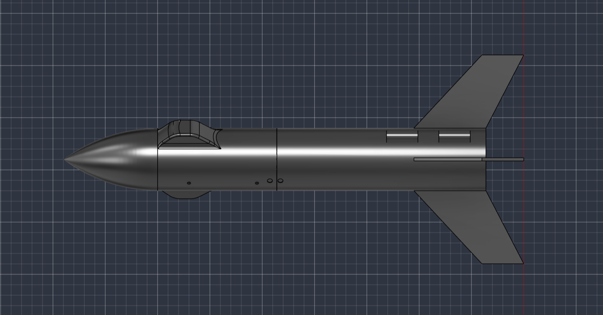
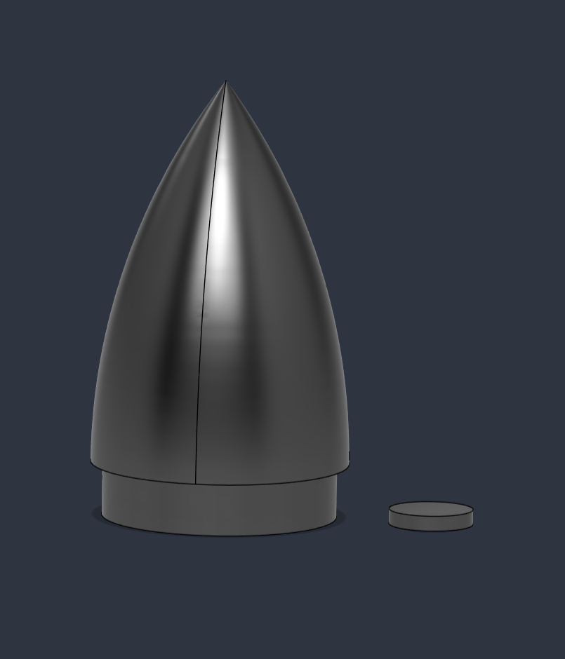
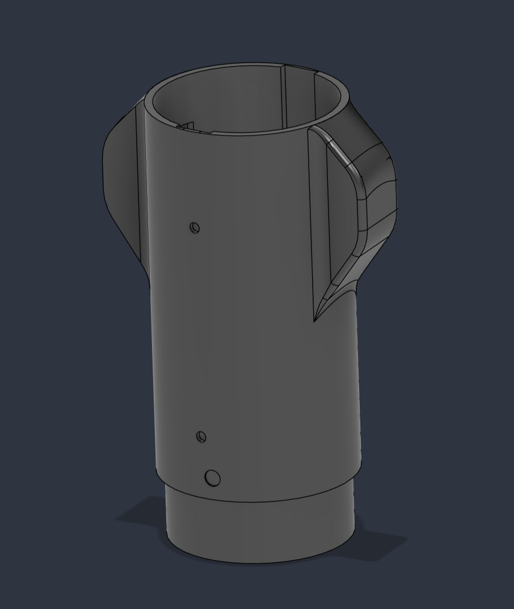
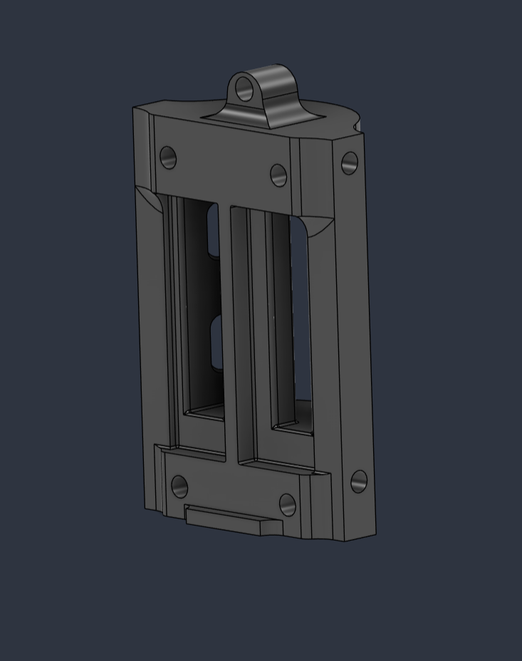
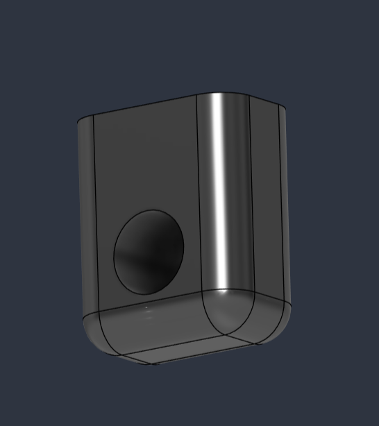
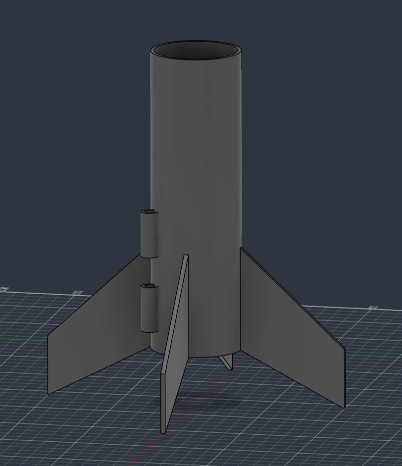
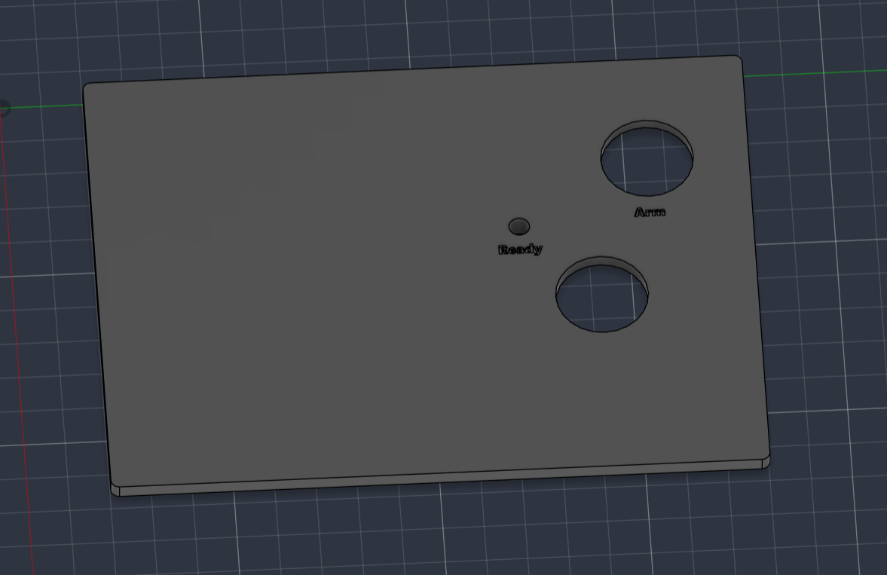
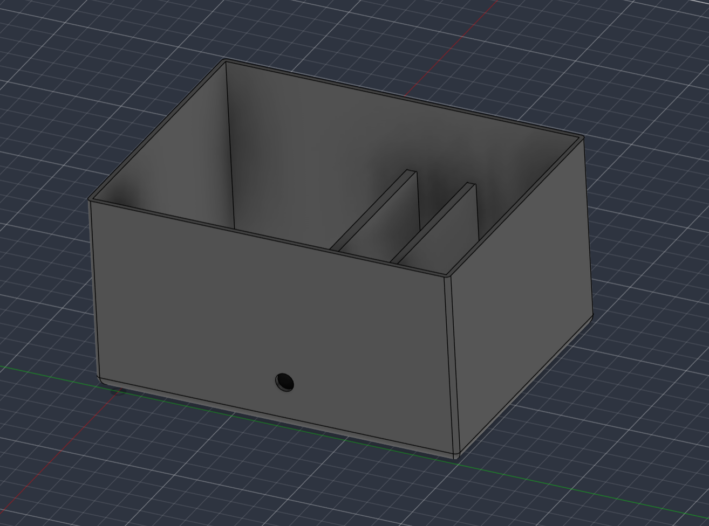
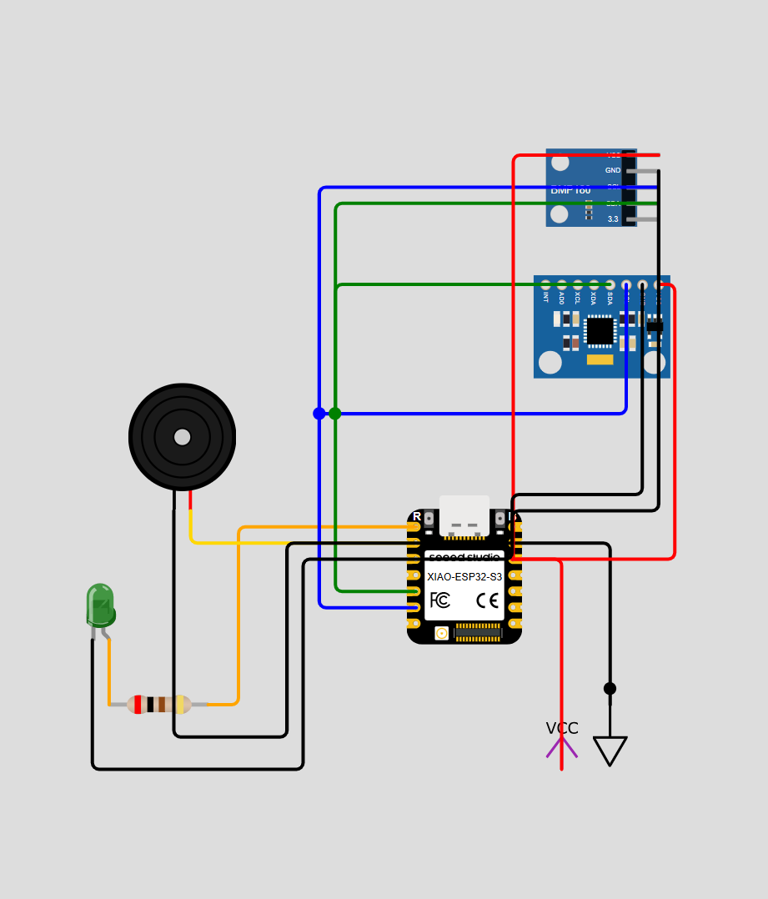
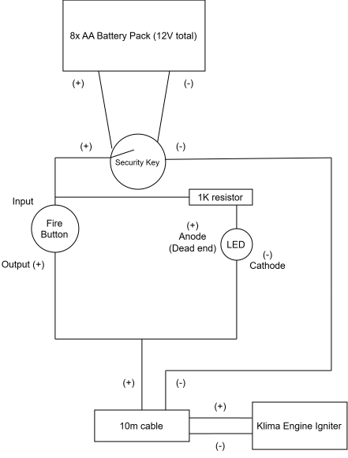

# Bean2Space 🚀
> The HRC-01: the first rocket of the Bean2Space program. A 3D printed DIY rocket powered by an ESP32-S3 flight computer running MicroPython featuring telemetry logging, a ground station and a trigger system.  
Also my submission to the [Stardance Challenge](https://stardance.hackclub.com/)!

## Overview
This project is basically made of three main components:
- **The flight computer**: An ESP32-S3 running micropython. Reads temperature and pressure from the BMP280 and gyroscope/accelerometer data from an MPU6050. Both via I2C. Also transmits live telemetry to the ground station using ESPNOW protocol. *In other terms : the brain of this project*
- **The ground station**: A simple ESP32-C3 that receives the telemetry packets and logs them *(more features to come later)*
- **The trigger Station**: A wired ignition trigger. Uses AA batteries, a safety key and a *red* trigger button.

## CAD and Hardware Design
### Source files and visuals
> All the CAD work has been done in **Fusion 360** but some initial .obj files have been imported from **[OpenRocket](https://openrocket.info/)**. 

- **Nose cone + bottom closure:** 
The nose cone has a hole on the bottom to add extra weight if ever needed. The bottom closure part closes the hole and is sealed using tape.
 
[Download nose_cone.step](cad/rocket/nose_cone.step)

---

- **Main Stage**: 
The main stage has two pods on both sides to add a small camera (SQ11 size), M3 screw holes to attach the inner rack (see below) with guide rails inside, 3 static port holes and finally an alignment hole to properly align main and engine stage.
 
[Download main_stage.step](cad/rocket/main_stage.step)

---

- **Instruments Rack**:  
The rack is slid in the stage's guide rails and secured with 4 M3 screws on the sides using inserts. The board is placed on one side and also secured with M3 screws while on the other side is the battery slot secured with velcro. On top there's a small handle to easily pull off the rack from the rocket.
 
[Download instruments_rack.step](cad/rocket/instruments_rack.step)

---

- **Shock Cord Mount**: 
Two of those mounts are placed on the bottom of the main stage shoulder and glued with epoxy. A long screw is slid between both holes with a nut at the end. Finally the shock cord is tied to the screw.
 
[Download shock_cord_mount.step](cad/rocket/shock_cord_mount.step)

---

- **Engine Stage**: 
The engine is slid in the 18mm hole on the bottom. The stage has two 6mm diameter launch lugs where you can slide the launch rod. On the bottom in the inside of the tube 4 holes allow you to tie the shock cord.
 
[Download engine_stage.step](cad/rocket/engine_stage.step)

---

- **Trigger Box Cover**: 
Here there are 3 holes, one for an led, another for the security key and a third one for the launch button.
 
[Download trigger_box_cover.step](cad/trigger_station/trigger_box_cover.step)

---

- **Trigger Box Body**: 
The box has a support to add velcro to it and put the two battery holders. It also has a hole to fit the ignition cable through it.
 
[Download trigger_box_body.step](cad/trigger_station/trigger_box_body.step)

### Wiring diagrams

### Flight computer

| Component | Component Pin | ESP32 Pin |
| :--- | :--- | :--- |
| **BMP280 & MPU6050** | VCC | 3.3V |
| | GND | GND |
| | SDA | GPIO5 (D4) |
| | SCL | GPIO6 (D5) |
| **Buzzer** | Signal (+) | GPIO3 (D2) |
| | (-) | GND |
| **Status LED** | Anode (+) | GPIO2 (D1) |
| | (-) | GND |

### Trigger Station

## Firmware 
Both the ESP32 S3 and C3 run MicroPython. Use [`esptool`](https://docs.espressif.com/projects/esptool/en/latest/esp32/) to flash them.

1. Flash the correct MicroPython version for each of the boards
2. - **ESP32-S3 (flight computer):** Upload everything in the `/firmware` folder onto the board (if possible don't upload the `/ground_station` folder as it will be useless for this board).

   - **ESP32-C3 (ground station)**: Upload all the files in `/software/ground_station` onto the board. Once uploaded release the COM port by closing the connection. Then open a PowerShell terminal and run `python -m serial.tools.miniterm COM(add here the correct port number) 115200`. You might need to install the `serial` module.  *Note: If nothing appears on screen try pressing CTRL+D to soft reset the connection*

## BOM

| Item Name | Qty | Notes |
| :--- | :---: | :--- |
| **BMP280 Sensor** | 1 | Module for measuring temperature and pressure in the rocket |
| **Buzzer** | 1 | A classic buzzer |
| **Green LED** | 1 | LEDs |
| **Seeed XIAO ESP32-S3** | 1 | Main microcontroller for the rocket |
| **MPU6050 Accelerometer/Gyro** | 1 | Accelerometer and gyro |
| **220Ω Resistor** | 1 | Well that's a resistor.. |
| **MicroSD Module** | 1 | To store data directly in flight |
| **LiPo Battery 3.7V 550mAh** | 2 | One to power the rocket and another for backup |
| **Seeed XIAO ESP32-C3** | 1 | Microcontroller for the ground station in charge of receiving telemetry data |
| **BCS050 Prototype Board** | 1 | To solder the components of the flight computer |
| **JST SYP Adapter** | 1 | To connect the battery to the microcontroller in the rocket |
| **AA Battery Holder** | 2 | To power the trigger station and ignite the rocket engine |
| **HP Cable (12 meters)** | 12 | To connect the trigger station to the rocket engine (usually sold per 1 meter) |
| **Black Crocodile Clip** | 1 | To connect the cable to the rocket engine electric igniters |
| **Red Crocodile Clip** | 1 | Same as above |
| **Security Key Switch** | 1 | A security key switch to turn on the trigger station and prevent accidental ignition |
| **Red Trigger Button** | 1 | To trigger the rocket engine ignition |
| **1/2W 1kΩ Resistors (Pack of 5)** | 5 | To limit the current in the trigger station |
| **Klima D9-5 Rocket Engines (Pack of 6)** | 6 | Well, that's the rocket engines... qty is 6 because they usually don't sell them separately|
| **Kevlar Cord (2 meters)** | 2 | Shock cord to connect the rocket tubes to the parachute (usually sold per 1 meter)|
| **22x22cm Nomex Parachute Protector** | 1 | To protect the parachute from the rocket engine heat (parachute will be put inside that) |
| **Klima Launch Pad Kit** | 1 | This is a launchpad kit |
| **6mm Launch Rod** | 1 |  The kit above already includes a launch rod, but it's too short and not stable enough for a rocket of this size

*Note: Last 5 items have been found on [SierraFox Hobbies](https://sierrafoxhobbies.com) website.*

### Full file with more details and information is available [here](BOM.csv).

## Why is it called like that ?
Well it's some kind of private joke with some of my friends, final goal of the project would be to actually put a bean in the rocket..